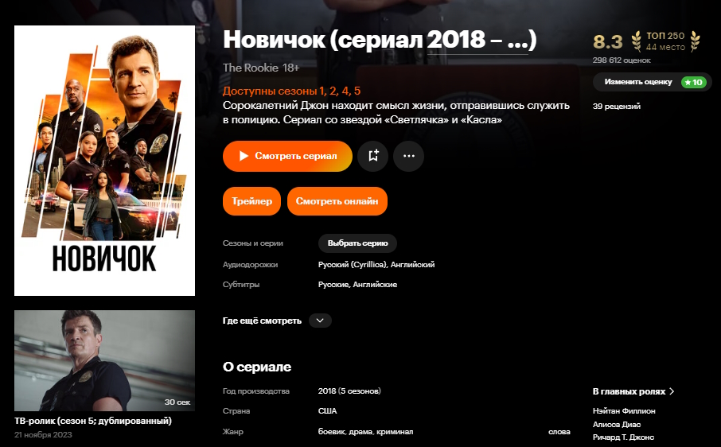
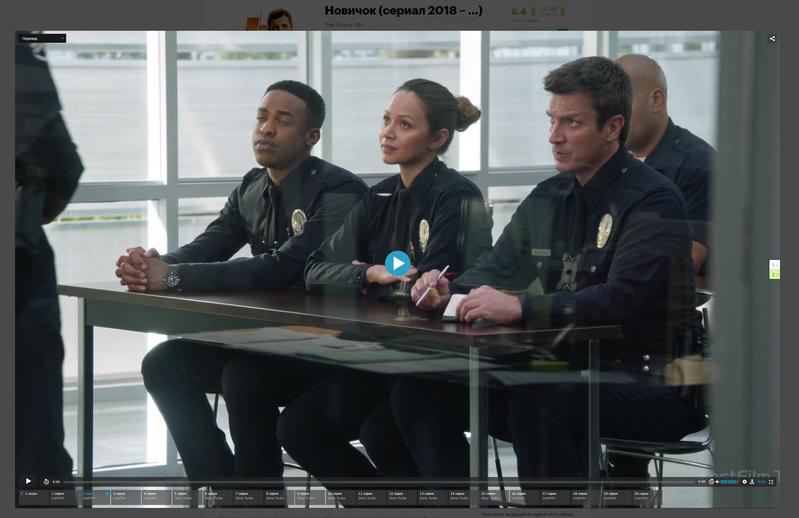
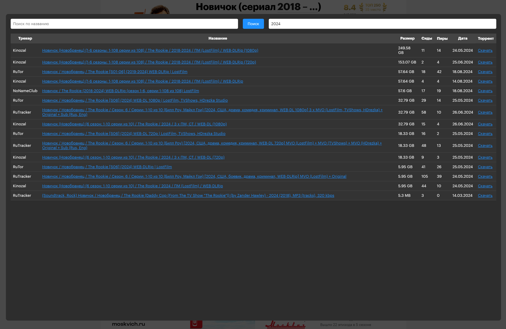
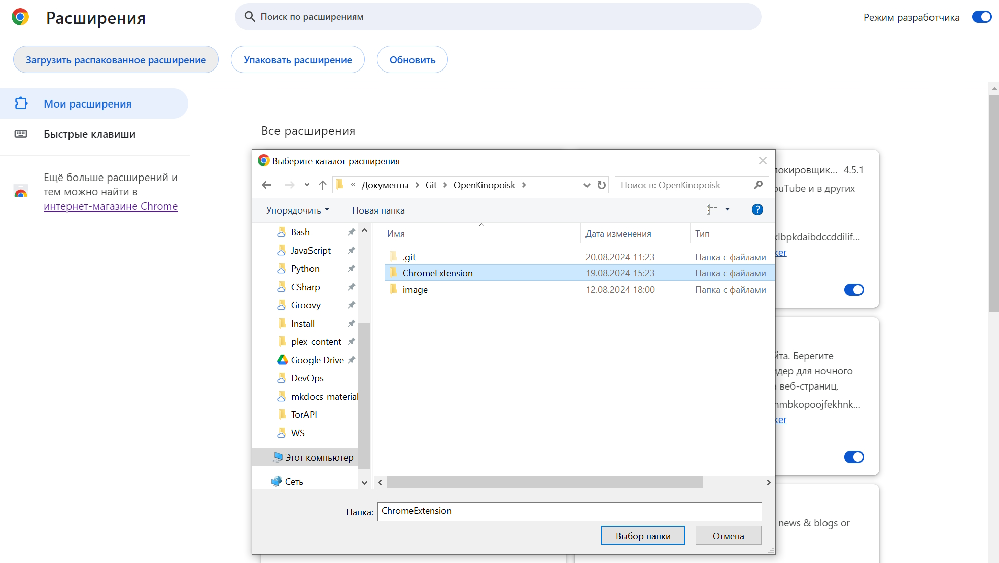
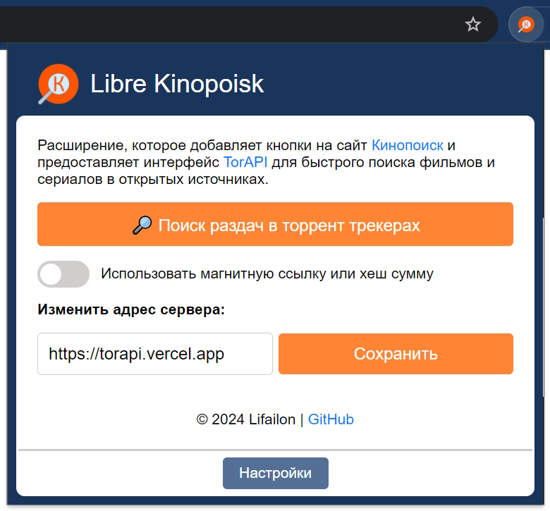
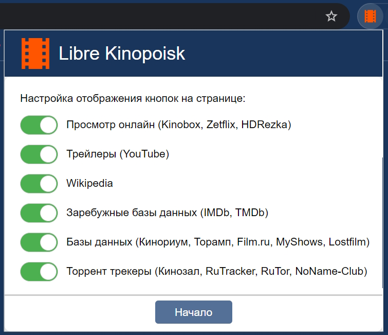

    

<h1 align="center">
     Libre Kinopoisk
</h1>

Расширение Google Chrome, которое добавляет кнопки на сайт [Кинопоиск](http://kinopoisk.ru) и предоставляет интерфейс [TorAPI](https://github.com/Lifailon/TorAPI) для быстрого поиска фильмов и сериалов в открытых источниках.

Проект вдохновлен расширением 🍿 [YoK](https://github.com/mrzlab630/chrome-extension-YoK) для поиска плееров через сервис [Kinobox](https://kinobox.tv) и интерфейсом 🧥 [Jackett](https://github.com/Jackett/Jackett) для централизованного поиска раздач в торрент трекерах.

### ✨ Реализовано:

- [x] Онлайн просмотр выбранного фильма или сериала в интегрированном плеере Kinobox через модальное окно (не покидая текущую страницу в браузере) или на сайте [Kinomix](https://kinomix.web.app) (можно изменить в настройках расширения).
- [x] Интерфейс для одновременного поиска раздач в нескольких торрент трекерах через [TorAPI](https://github.com/Lifailon/TorAPI) с поддержкой фильтрации и сортировки в стиле [Jackett](https://github.com/Jackett/Jackett), без необходимости устанавливать серверную часть и использовать VPN для поиска. Для загрузки торрент файлов, достаточно воспользоваться любым расширением VPN для браузера, например, [Browsec](https://browsec.com/ru).
- [x] Интерфейс настройки расширения.
- [x] Дополнительные кнопки для быстрого поиска во внешних источниках:
- Трейлеры на [YouTube](https://youtube.com).
- Информация на [Wikipedia](https://ru.wikipedia.org).
- Просмотр онлайн на [Zone](https://g1.zona.plus), [Zetflix](https://zeflix.online) и [HDRezka](https://hdrezka.ag).
- Зарубежные базы данных [IMDb](https://imdb.com) и [TMDB](https://themoviedb.org).
- Русскоязычные базы данных [Кинориум](https://ru.kinorium.com), [Торамп](https://www.toramp.com), [Film.ru](https://www.film.ru), [MyShows](https://myshows.me) и [Lostfilm](https://lostfilm.tv) с распианием даты выхода сериалов.
- Торрент трекеры [Кинозал](https://kinozal.tv), [RuTrucker](https://rutracker.org), [RuTor](https://rutor.info) и [NoName-Club](https://nnmclub.to) с фильтрацией по оригинальному названию и году выхода.
- [ ] Добавить кнопки для версии сайта [Кинопоиск HD](https://hd.kinopoisk.ru) (на текущий момент добавлена только одна кнопка для просмотра онлайн).
- [ ] Добавить кнопки получения магнитных ссылок, для загрузки содержимого раздачи через любой торрент клиент.

<h1 align="center">
    </a> </a>
</h1>

---

### 🚀 Установка

- [Скачайте расширение](https://github.com/Lifailon/LibreKinopoisk/archive/refs/heads/rsa.zip) из GitHub репозитория и распакуйте zip-архив.
- Откройте страницу с расширениями Google Chrome: `chrome://extensions`.
- Включите **режим разработчика** в правом верхнем углу.
- **Загрузите распакованное расширение** и выберите директорию `ChromeExtension` из архива.

> Если кнопки отображаются на странице и сразу пропадают, отключите блокировщик рекламы в интерфейсе расширения (например, [uBlock](https://github.com/gorhill/uBlock) или [ADB](https://adblockplus.org)) для текущей страницы [Кинопоиска](www.kinopoisk.ru).

- Вы можете использовать интерфейс поиска раздач в торрент трекерах находясь на любой странице браузера через модальное окно, а также изменить адрес сервера и настроить отображение кнопок в **интерфейсе расширения**:

<h1 align="center">
    </a> </a>
</h1>

Что бы запустить свой **TorAPI** сервер в Docker контейнере или развернуть его на Vercel, воспользуйтесь инструкцией в репозитории на [GitHub](https://github.com/Lifailon/TorAPI).

---

## Другие проекты:

- ✨ [TorAPI](https://github.com/Lifailon/TorAPI) - неофициальный `API` сервер (backend) для торрент трекеров RuTracker, Kinozal, RuTor и NoNameClub, который используется для централизованного получения торрент файлов и подробной информации о раздаче по названию фильма, сериала или идентификатору раздачи в формате `JSON`, а также предоставляет новостную `RSS` ленту для всех провайдеров.

- 🧲 [Telegram бот для Кинозал](https://github.com/Lifailon/Kinozal-Bot) - позволяет автоматизировать процесс доставки контента до вашего телевизора, используя только телефон, предоставляющий привычный и удобный интерфейс для взаимодействия с торрент трекером [Кинозал](https://kinozal.tv), а также возможность управлять торрент клиентом [qBittorrent](https://github.com/qbittorrent/qBittorrent) или [Transmission](https://github.com/transmission/transmission) на вашем компьютере и синхронизацию с [Plex Media Server](https://www.plex.tv/personal-media-server), находясь удаленно от дома.

- ❤️ [WebTorrent Desktop api](https://github.com/Lifailon/webtorrent-desktop-api) - форк [WebTorrent Desktop](https://github.com/webtorrent/webtorrent-desktop) клиента, в котором добавлен механизм удаленного управления через `REST API` на базе [Express Framework](https://github.com/expressjs/express).

- 📡 [Reverse Proxy .NET](https://github.com/Lifailon/rpnet) - кроссплатформенная утилита командной строки для реализации обратного прокси-сервер на базе .NET. Используется для предоставления доступа хостам с одного сетевого интерфейса к удаленным приложениям через протоколы TCP, UDP или HTTP/HTTPS доступных через другой сетевой интерфейс без лишних настроек и с поддержкой авторизации.