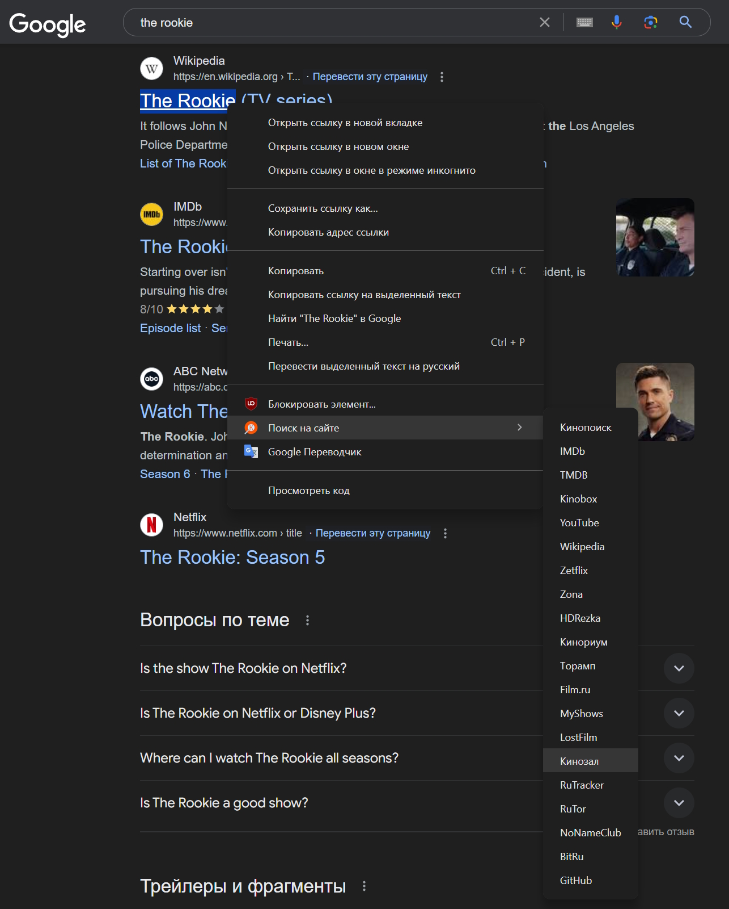
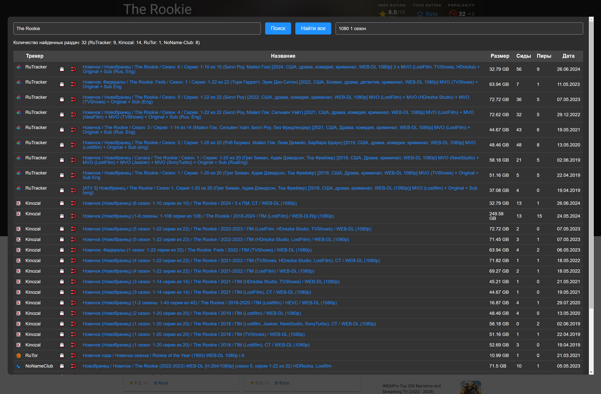
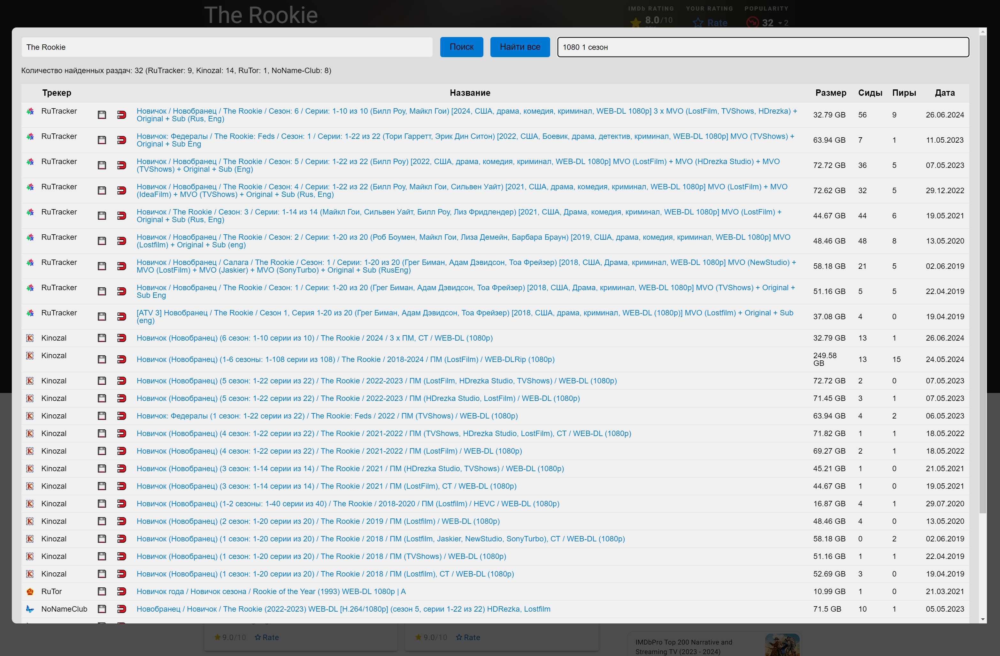
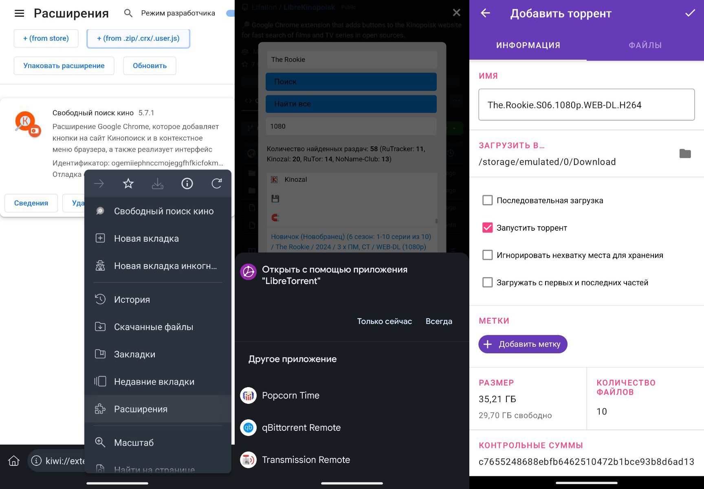

    

<h1 align="center">
    Libreinopoisk
</h1>

Расширение Google Chrome, которое добавляет кнопки на сайт [Кинопоиск](http://kinopoisk.ru) и в контекстное меню браузера, а также реализует интерфейс [TorAPI](https://github.com/Lifailon/TorAPI) для быстрого поиска фильмов и сериалов в открытых источниках. Интерфейс расширения адаптирован для работы на устройствах **Andrioid** в вертикальной ориентации, который вы можете [установить](#android) и использовать через 🥝 [Kiwi браузер](https://kiwibrowser.com).

Проект вдохновлен расширением 🍿 [YoK](https://github.com/mrzlab630/chrome-extension-YoK) для поиска плееров через **api [Kinobox](https://kinobox.tv)** и интерфейсом 🧥 [Jackett](https://github.com/Jackett/Jackett) для централизованного поиска раздач в торрент трекерах.

### 💁 Зачем это нужно?

Ознакомьтесь со статья на Хабр: [Jackett и альтернативные решения (интерфейсы и api) для поиска торрентов](https://habr.com/ru/articles/841924), в которой кратко изложено какие существуют решения для автоматизации процесса поиска торрентов.

В отличии от Jackett и поисковых плагинов, вам не нужно **не нужно использовать VPN  для доступа к трекерам**, а также не требуется авторизация для получения хеш суммы или магнитных ссылок. Для поиска раздач, расширение использует внешний **backend** - [TorAPI](https://github.com/Lifailon/TorAPI), по этому вам не обязательно устанавливать серверную часть, вы можете использовать публичную и бесплатную версию размещенную на Vercel, или [развернуть](https://github.com/Lifailon/TorAPI?tab=readme-ov-file#-deploy) ее самостоятельно.

### ✨ Реализовано:

- [x] Интерфейс поиска раздач в нескольких торрент трекерах с поддержкой фильтрации (поддерживается неточный поиск) и сортировки. Доступна светлая и темная тема, а также одновременный поиск всех доступных раздач (на всех доступных страницах в трекерах).
- [x] Онлайн просмотр выбранного фильма или сериала в интегрированном плеере [Kinobox](https://kinobox.tv) через модальное окно (не покидая текущую страницу в браузере, переключение между доступными плеерами возможно с помощью меню справа) или на сайте [Kinomix](https://kinomix.web.app) (можно изменить в настройках расширения). Кнопка для просмотра онлайн доступена также для версии сайта [Кинопоиск HD](https://hd.kinopoisk.ru).
- [x] Дополнительные кнопки для быстрого поиска во внешних источниках (доступны на сайте Кинопоиск и через контекстное меню):
- Трейлеры на [YouTube](https://youtube.com) и дополнительная информация на [Wikipedia](https://ru.wikipedia.org).
- Просмотр онлайн во внешних сервисах: [Zetflix](https://zeflix.online), [Zone](https://g1.zona.plus), [HDRezka](https://hdrezka.ag).
- Зарубежные базы данных о кинематографе: [IMDb](https://imdb.com) и [TMDB](https://themoviedb.org).
- Русскоязычные базы данных: [Кинориум](https://ru.kinorium.com), [Торамп](https://www.toramp.com), [Film.ru](https://www.film.ru), [MyShows](https://myshows.me) и [Lostfilm](https://lostfilm.tv) с распианием даты выхода серий.
- Торрент трекеры: [Кинозал](https://kinozal.tv), [RuTrucker](https://rutracker.org), [RuTor](https://rutor.info), [NoName-Club](https://nnmclub.to), [BitRu](https://bitru.org) с фильтрацией по оригинальному названию и году выхода.

<h1 align="center">
    </a>
    </a>
</h1>

Для загрузки контента через интерфейс поиска раздач вы можете использовать **🧲 магнитную ссылку** (включено в настроках расширения по умолчанию), где после перехода по ссылке вы будете автоматически перенаправлены в ваш торрент клиент по умолчанию для автоматической загрузки или хеш сумму (`info hash`), которую вы можете передать в любой торрент клиент и начать загрузку сразу после получения метаданных. Если вы хотите **💾 скачать торрент файл** напрямую с трекера, вы можете воспользоваться любым расширением `VPN` для браузера, например, [Browsec](https://browsec.com/ru).

---

### 🚀 Установка

- [Скачайте расширение](https://github.com/Lifailon/LibreKinopoisk/archive/refs/heads/rsa.zip) из GitHub репозитория и распакуйте zip-архив.
- Откройте страницу с расширениями Google Chrome: `chrome://extensions`.
- Включите **режим разработчика** в правом верхнем углу.
- **Загрузите распакованное расширение** и выберите директорию `ChromeExtension` из архива.

> Если кнопки отображаются на странице и сразу пропадают, отключите блокировщик рекламы в интерфейсе расширения (например, [uBlock](https://github.com/gorhill/uBlock) или [ADB](https://adblockplus.org)) для текущей страницы [Кинопоиска](www.kinopoisk.ru), **может потребоваться переустановка расширения**. Также добавлена кнопка для открытия трейлера во внешней вкладке (используется вместо встроенного плеера Кинопоиск в модальном окне, для возможности блокировать рекламу).

- Вы можете использовать интерфейс поиска раздач в торрент трекерах находясь на любой странице браузера через модальное окно. Переключение на темный режим и настройка отображение кнопок доступно через интерфейсе расширения:

<h1 align="center">
    </a> </a>
</h1>

---

### Android

- Установите **Kiwi** браузер из [Google Play](https://play.google.com/store/apps/details?id=com.kiwibrowser.browser&hl=en_US) или [GitHub](https://github.com/kiwibrowser/src.next/releases) репозитория.

> Браузер имеет открытый исходный код. По мимо установки любых расширений, из коробки поддерживается использование темного режима на всех сайтах, встроенную функцию блокировки рекламы, а также инструменты разработчика (DevTools).

- [Скачайте расширение](https://github.com/Lifailon/LibreKinopoisk/archive/refs/heads/rsa.zip), перейдите на вкладку `Расширения`, включите режим разработчика и добавьте архив с загруженным расширение (распаковка не требуется) через кнопку `+(from .zip)`.

Интерфейс поиска раздач доступен через интерфейс расширения на любой веб-стрицы в браузере. При использовании **🧲 магнитных ссылок**, устройтсво автоматически определит ваш торрент клиент по умолчанию (например, [LibreTorrent](https://github.com/proninyaroslav/libretorrent)) или предложит выбор, после чего сразу начнется загрузка метаданных раздачи, **VPN не требуется**.

> Для работоспособности кнопок на сайте Кинопоиск, включите режим `Версия для ПК` и отключилите блокировку рекламы для текущего сайта.

---

## Другие проекты:

- ✨ [TorAPI](https://github.com/Lifailon/TorAPI/blob/main/README_RU.md) - неофициальный `API` (backend) для торрент трекеров RuTracker, Kinozal, RuTor и NoNameClub. Используется для быстрого поиска раздач, а также получения torrent-файлов, магнитных ссылок и подробной информации о раздаче по названию фильма, сериала или идентификатору раздачи, а также предоставляет новостную RSS ленту для всех провайдеров.

- 🧲 [Kinozal Bot](https://github.com/Lifailon/Kinozal-Bot) - Telegram бот, который позволяет автоматизировать процесс доставки контента до вашего телевизора, используя только телефон. Предоставляет удобный интерфейс для взаимодействия с торрент трекером [Кинозал](https://kinozal.tv) и базой данных [TMDB](https://www.themoviedb.org) для отслеживания даты выхода серий, сезонов и поиска актеров для каждой серии, а также возможность управлять торрент клиентом [qBittorrent](https://github.com/qbittorrent/qBittorrent) или [Transmission](https://github.com/transmission/transmission) на вашем компьютере, находясь удаленно от дома и из единого интерфейса.

- ❤️ [WebTorrent Desktop api](https://github.com/Lifailon/webtorrent-desktop-api) - форк клиента [WebTorrent Desktop](https://github.com/webtorrent/webtorrent-desktop), в котором добавлен механизм удаленного управления через `REST API` на базе [Express Framework](https://github.com/expressjs/express).

- 📡 [Reverse Proxy .NET](https://github.com/Lifailon/rpnet/blob/main/README_RU.md) - кроссплатформенная утилита командной строки для реализации обратного прокси-сервер на базе **.NET**. Используется для предоставления доступа хостам в сети с одного сетевого интерфейса к удаленным приложениям через протоколы **TCP**, **UDP** или **HTTP/HTTPS** (поддерживаются `GET` и `POST` запросы для доступа к внешним ресурсам через Интернет) доступных через другой сетевой интерфейс (например, через **VPN**) на вашем хосте без лишних настроек и с поддержкой авторизации.